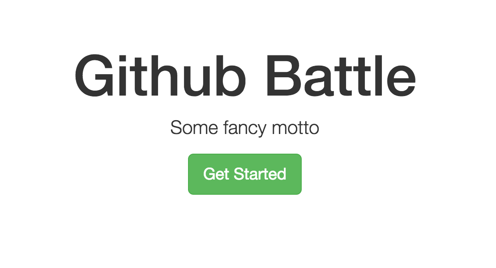
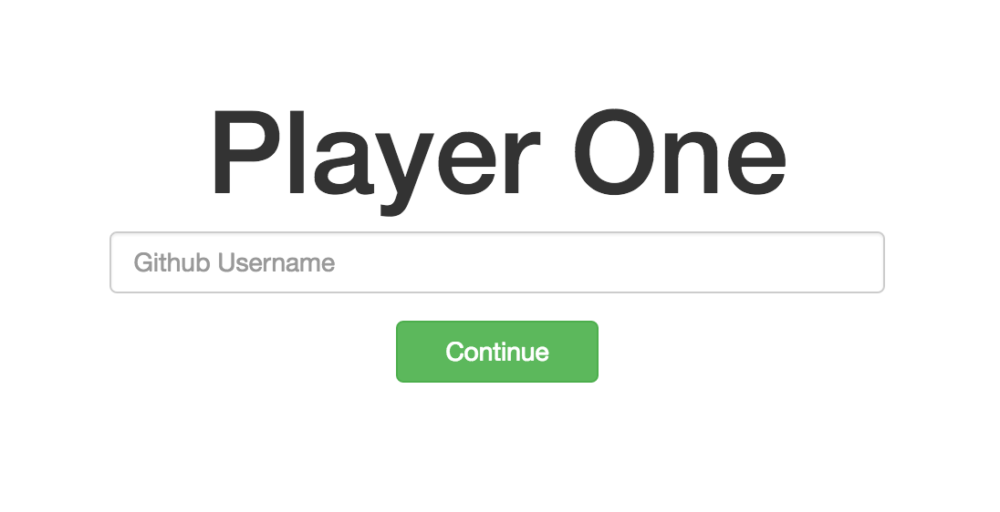
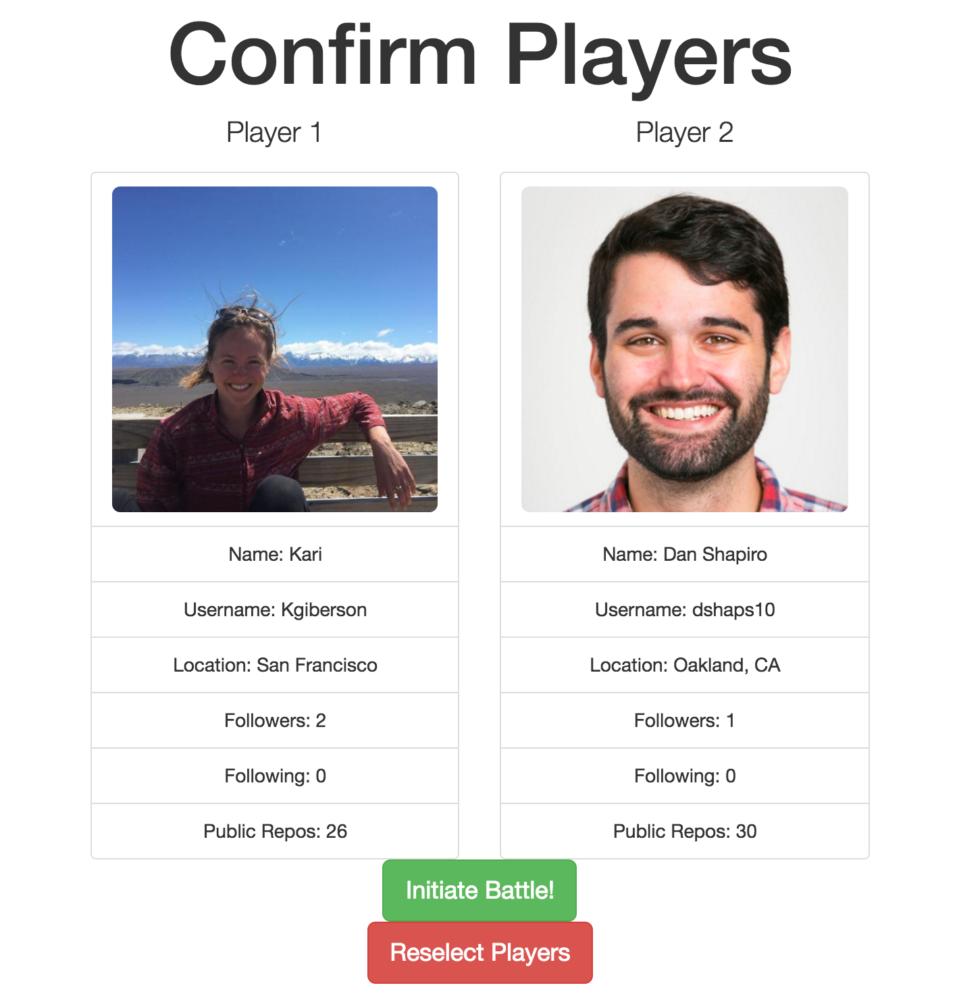

# Github Battle

It's a face-off between Github users. Put in any two usernames and get a breakdown of followers, people following and total public repos.

## Source
This repository follows the [ReactJS Fundamentals](http://courses.reactjsprogram.com/courses/reactjsfundamentals) course from [ReactJS Program](http://www.reactjsprogram.com/).

## License
MIT License